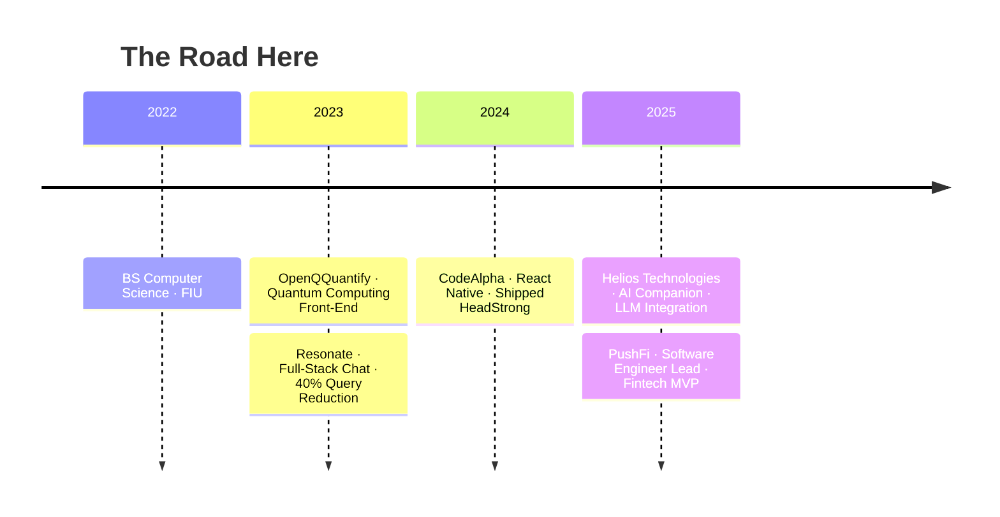

<div align="center">

<a href="https://git.io/typing-svg"></a>

<br/>

<a href="mailto:EJacoby.dev@gmail.com"></a>
<a href="https://www.linkedin.com/in/eric-jacobowitz/"></a>
<a href="https://github.com/EJacoby515"></a>

<br/><br/>


<a href="https://github.com/EJacoby515?tab=followers"></a>

</div>

<br/>

---

## The Arc

<table>
<tr>
<td width="55%" valign="top">

```typescript
const eric: Engineer = {
  current:    "Software Engineer Lead @ PushFi",
  location:   "Miami, FL",

  before: [
    "Firefighter — Broward Sheriff's Office",
    "Firefighter — Ft. Myers Beach Fire Control",
    "ER Paramedic — Broward Health Medical Center",
  ],

  // what the fire service teaches you:
  superpower: [
    "Calm under pressure",
    "High-stakes decision making in seconds",
    "Team leadership when it actually matters",
    "Unwavering commitment to reliability",
  ],

  timeline: "Jul 2023 → Lead · going on 3 years",
};
```

</td>
<td width="45%" valign="top">

<div align="center">

<br/>

**Measured. Shipped. In production.**

<br/>


<br/>


<br/>


<br/>


<br/><br/>

> *These aren't estimates.*
> *These are diffs.*

</div>

</td>
</tr>
</table>

---

## What I'm Building Now

<div align="center">

### Software Engineer Lead · [PushFi](https://github.com/EJacoby515) · `Sept 2025 – Present`

*An Uber-style lending platform bringing capital access to underserved communities.*

<br/>

<table>
<tr>
<td align="center" width="20%">
<b>Full Stack</b><br/>
<sub>React · Node.js<br/>PostgreSQL</sub>
</td>
<td align="center" width="20%">
<b>Smart Matching</b><br/>
<sub>Automated lender<br/>matching engine</sub>
</td>
<td align="center" width="20%">
<b>Compliance</b><br/>
<sub>KYC integrations<br/>for regulatory fit</sub>
</td>
<td align="center" width="20%">
<b>1,000 Agents</b><br/>
<sub>Acquisition target<br/>in 90 days</sub>
</td>
<td align="center" width="20%">
<b>$50M</b><br/>
<sub>First-year<br/>funding target</sub>
</td>
</tr>
</table>

</div>

---

## Stack

<div align="center">

**Frontend**<br/>


<br/>

**Backend & Data**<br/>


<br/>

**Mobile**<br/>


<br/>

**Infrastructure & Tools**<br/>


</div>

---

## GitHub

<div align="center">


<br/>


<br/>


<br/>

<picture>
  <source media="(prefers-color-scheme: dark)" srcset="https://raw.githubusercontent.com/platane/snk/output/github-contribution-grid-snake-dark.svg">
  
</picture>

</div>

---

## Career

<div align="center">



</div>

<details>
<summary><b>&nbsp;Full experience breakdown</b></summary>

<br/>

<table>
<tr><td>

**Software Engineer I · Helios Technologies** &nbsp;`Feb 2025 – Sept 2025`

Joined an AI companion startup mid-flight. Modernized the codebase (TypeScript + React + Vite), integrated LLMs into production, migrated config from client → server, built out RESTful API layer.

</td></tr>
<tr><td>

**Software Engineer Intern · CodeAlpha** &nbsp;`Sept 2024 – Apr 2025`

Cross-platform React Native development. Component architecture, state management. Independently scoped and shipped **HeadStrong** — a mental health app built privacy-first.

</td></tr>
<tr><td>

**Software Engineer Intern · Resonate** &nbsp;`Sept 2023 – Dec 2024`

Built full-stack chat system on React Native + PocketBase. Cut DB queries **40%**. Improved DB performance **30%** through data lifecycle management. Refactored TypeScript navigation — **25%** fewer bugs.

</td></tr>
<tr><td>

**Software Engineer Intern · OpenQQuantify** &nbsp;`Jul 2023 – Feb 2024`

Front-end components for a quantum computing platform. Collaborated directly with researchers to translate algorithm outputs into usable UI.

</td></tr>
</table>

</details>

---

## Projects

<div align="center">

<a href="https://github.com/EJacoby515/headstrong">
  
</a>
<a href="https://github.com/EJacoby515/personalPortfolio">
  
</a>

</div>

<br/>

<table>
<tr>
<td width="50%" valign="top">

**HeadStrong — Mental Health for Men**

`React Native` `TypeScript` `Firebase` `Expo`

Identified a real gap: mental health tools for men are either clinical or absent. Built a privacy-first app with mood tracking, activity streaks, data visualization, and peer communities. Shipped it independently.

</td>
<td width="50%" valign="top">

**Portfolio AI Chatbot**

`React` `TypeScript` `OpenRouter` `Framer Motion`

Not just a portfolio — it talks back. Built a custom LLM chatbot using OpenRouter's API with a 3-model fallback chain (Llama 3.2 → Llama 3.3 → Gemma), animated with Framer Motion, and restricted to answering only about me.

</td>
</tr>
</table>

---

## Education

<div align="center">

| | Institution | Note |
|---|---|---|
| **BS Computer Science** | Florida International University · 2022 | |
| **Firefighter / Paramedic Cert** | Broward Fire Academy | Made me a better engineer than any bootcamp could |

</div>

---

<div align="center">

<br/>

### If you're building something that matters — let's talk.

*I don't just write code. I ship products, lead teams, and solve problems under pressure.*
*The fire service taught me that. Nearly three years in tech proved it.*

<br/>

<a href="mailto:EJacoby.dev@gmail.com">
  
</a>
&nbsp;
<a href="https://www.linkedin.com/in/eric-jacobowitz/">
  
</a>

<br/><br/>


<br/>

</div>


