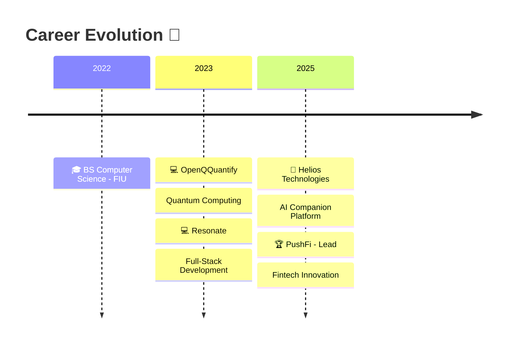

<div align="center">
  
  <!-- Animated Typing -->
  <a href="https://git.io/typing-svg"></a>

  <!-- Social Badges with Hover Effects -->
  <p>
    <a href="mailto:EJacoby.dev@gmail.com">
      
    </a>
    <a href="https://www.linkedin.com/in/eric-jacobowitz/">
      
    </a>
    <a href="https://github.com/EJacoby515">
      
    </a>
    <a href="tel:9542433376">
      
    </a>
  </p>
  
  <!-- Profile Views & Followers -->
  <p>
    
    <a href="https://github.com/EJacoby515?tab=followers">
      
    </a>
  </p>
  
</div>

<!-- Animated Divider -->


##  &nbsp;About Me


```typescript
const eric = {
  role: "Software Engineer Lead @ PushFi",
  location: "Miami, FL 🌴",
  background: "Firefighter/Paramedic → Tech",
  
  currentFocus: [
    "Building Uber-style lending platform",
    "Fintech & Financial Inclusion",
    "AI-powered solutions"
  ],
  
  funFact: "I've saved lives in burning buildings
            AND in production deployments 🔥"
};
```

<br/>

> 💡 *"From responding to emergencies to engineering solutions — I bring the same intensity, precision, and commitment to every line of code."*

<br clear="both"/>

<!-- Animated Divider -->


##  Tech Stack

<div align="center">

### 🎨 Frontend
<p>
  <a href="#"></a>
</p>

### ⚙️ Backend
<p>
  <a href="#"></a>
</p>

### 🛠️ Tools & DevOps
<p>
  <a href="#"></a>
</p>

</div>

<!-- Animated Divider -->


##  GitHub Analytics

<div align="center">
   
  
</div>

<div align="center">
  
</div>

<!-- Activity Graph -->
<div align="center">
  
</div>

<!-- Snake Animation -->
<div align="center">
  <picture>
    <source media="(prefers-color-scheme: dark)" srcset="https://raw.githubusercontent.com/platane/snk/output/github-contribution-grid-snake-dark.svg">
    <source media="(prefers-color-scheme: light)" srcset="https://raw.githubusercontent.com/platane/snk/output/github-contribution-grid-snake.svg">
    
  </picture>
</div>

<!-- Animated Divider -->


## 💼 Professional Journey

<div align="center">



</div>

###  Current Role

<table>
<tr>
<td width="100%">

### 🚀 Software Engineer Lead | PushFi
**`Sept 2025 - Present`** &nbsp; 📍 Remote


Building an **Uber-style lending platform** democratizing access to capital for underserved communities.

<details>
<summary><b>🔍 Key Achievements</b></summary>
<br/>

| Impact | Description |
|--------|-------------|
| 🏗️ **Architecture** | Designed React/Node.js/PostgreSQL stack with automated lender-matching engine |
| 🔐 **Security** | Implemented third-party KYC integrations for compliance |
| 📊 **Dashboards** | Built borrower onboarding wizard & agent dashboards |
| 🎯 **Leadership** | Driving daily stand-ups, targeting 1,000 agent acquisition in 90 days |
| 💰 **Scale** | Supporting $50M first-year funding target |

</details>

</td>
</tr>
</table>

<details>
<summary><h3>📜 Previous Experience</h3></summary>
<br/>

<table>
<tr>
<td>

#### 🤖 Software Engineer I | Helios Technologies
**`Feb 2025 - Sept 2025`** &nbsp; 📍 Remote

- Modernized AI companion platform using **TypeScript**, **React**, and **Vite**
- Migrated environment configs from client-side to server-side
- Implemented RESTful APIs for seamless integration

</td>
</tr>
<tr>
<td>

#### 💬 Software Engineer Intern | Resonate  
**`Sept 2023 - Dec 2024`** &nbsp; 📍 Remote

- Built full-stack chat system with **React Native** & **PocketBase**
- **40%** reduction in database queries
- **30%** improvement in database performance
- **25%** reduction in navigation bugs through TypeScript refactoring

</td>
</tr>
<tr>
<td>

#### ⚛️ Software Engineer Intern | OpenQQuantify
**`Jul 2023 - Feb 2024`** &nbsp; 📍 Remote

- Developed front-end components for quantum computing platform
- Collaborated on quantum algorithm optimization

</td>
</tr>
</table>

</details>

<!-- Animated Divider -->


## 🔥 Featured Projects

<div align="center">

<a href="https://github.com/EJacoby515/headstrong">
  
</a>
<a href="https://github.com/EJacoby515/portfolio">
  
</a>

</div>

<br/>

<table>
<tr>
<td width="50%" valign="top">

### 🧠 HeadStrong
#### Mental Health App for Men

<div align="center">
  
  
  
  
</div>

<br/>

```
✅ Mood Tracking & Visualization
✅ Activity Streaks & Gamification  
✅ Peer Support Communities
✅ Cross-Platform (iOS & Android)
```

> 🎯 **Impact**: Breaking stigma around men's mental health with accessible, intuitive tools

</td>
<td width="50%" valign="top">

### 🤖 AI Resume Chatbot
#### Interactive Portfolio Experience

<div align="center">
  
  
  
</div>

<br/>

```
✅ Natural Language Interface
✅ Context-Aware Responses
✅ Error Handling & Retry Logic
✅ Professional Information Access
```

> 🎯 **Impact**: Revolutionizing how recruiters interact with portfolios

</td>
</tr>
<tr>
<td width="50%" valign="top">

### 📋 Task Management App
#### AI-Powered Productivity

<div align="center">
  
  
  
  
</div>

<br/>

```
✅ AI-Driven Task Prioritization
✅ ChatGPT API Integration
✅ AWS EC2/RDS Deployment
✅ Role-Based Access Control
```

> 🎯 **Impact**: **25%** increase in task completion rates

</td>
<td width="50%" valign="top">

### 🚀 What's Next?
#### Always Building...

<div align="center">
  
</div>

<br/>

```
🔨 PushFi Lending Platform
🔨 More AI Integrations
🔨 Open Source Contributions
🔨 Developer Tools
```

> 💡 **Got an idea?** Let's collaborate!

</td>
</tr>
</table>

<!-- Animated Divider -->


## 🎓 Education & Certifications

<div align="center">

| 🎓 Education | 📍 Institution | 📅 Year |
|-------------|----------------|---------|
| **BS Computer Science** | Florida International University | 2022 |
| **Firefighter/Paramedic** | Broward Fire Academy & College | — |

</div>

<!-- Animated Divider -->


## 🌟 Let's Connect!

<div align="center">

 

**I love connecting with fellow developers and innovators!**

Whether you want to discuss **fintech**, **AI**, **startups**, or just geek out about code — I'm always up for a conversation.

<br/>

<a href="mailto:EJacoby.dev@gmail.com">
  
</a>
<a href="https://www.linkedin.com/in/eric-jacobowitz/">
  
</a>
<a href="https://github.com/EJacoby515">
  
</a>

<br/><br/>

### 💭 Random Dev Quote


</div>

<!-- Footer Wave -->

