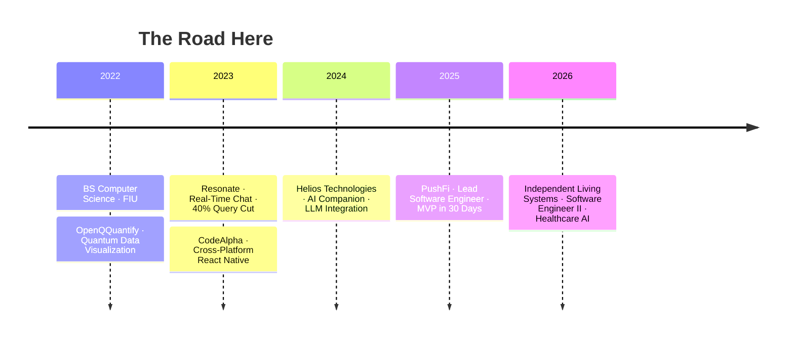

<div align="center">

<a href="https://git.io/typing-svg"></a>

<br/>

<a href="mailto:EJacoby.dev@gmail.com"></a>
<a href="https://www.linkedin.com/in/eric-jacobowitz/"></a>
<a href="https://github.com/EJacoby515"></a>

<br/><br/>


<a href="https://github.com/EJacoby515?tab=followers"></a>

</div>

<br/>

---

## The Arc

<table>
<tr>
<td width="55%" valign="top">

```typescript
const eric: Engineer = {
  current:    "Software Engineer II, Innovation @ Independent Living Systems",
  alsoActive: "Firefighter / Paramedic · 24-on / 48-off",
  location:   "Miami, FL",

  before: [
    "Lead Software Engineer — PushFi",
    "Software Engineer I — Helios Technologies",
    "ER Paramedic — Broward Health Medical Center",
  ],

  // what the fire service teaches you:
  superpower: [
    "Calm under pressure",
    "High-stakes decision making in seconds",
    "Team leadership when it actually matters",
    "Unwavering commitment to reliability",
  ],

  // full circle: from treating patients to building the tools behind their care
  timeline: "Jun 2022 → now · 4+ years shipping",
};
```

</td>
<td width="45%" valign="top">

<div align="center">

<br/>

**Measured. Shipped. In production.**

<br/>


<br/>


<br/>


<br/>


<br/>


<br/><br/>

> *These aren't estimates.*
> *These are diffs.*

</div>

</td>
</tr>
</table>

---

## What I'm Building Now

<div align="center">

### Software Engineer II, Innovation · Independent Living Systems (ILS) · `Sept 2026 – Present`

*Secure, HIPAA-compliant healthcare software for ILS and its affiliated health plans, Florida Community Care and Florida Complete Care.*

<br/>

<table>
<tr>
<td align="center" width="25%">
<b>HL7 Migration</b><br/>
<sub>Leading the move off a<br/>legacy HL7 engine</sub>
</td>
<td align="center" width="25%">
<b>eCare Modernization</b><br/>
<sub>Interoperability<br/>&amp; reliability</sub>
</td>
<td align="center" width="25%">
<b>Enterprise AI</b><br/>
<sub>Claude-based agents,<br/>human-in-the-loop for PHI</sub>
</td>
<td align="center" width="25%">
<b>Settings Architecture</b><br/>
<sub>Postgres + JSONB,<br/>design → implementation</sub>
</td>
</tr>
</table>

<br/>

*I spent years treating patients in the field and the ER. Now I build the software behind their care.*

</div>

---

## Stack

<div align="center">

**Frontend**<br/>


<br/>

**Backend & Data**<br/>


<br/>

**Mobile**<br/>


<br/>

**Infrastructure & Tools**<br/>


<br/>

**AI**<br/>


</div>

---

## GitHub

<div align="center">


<br/>


<br/>


<br/>

<picture>
  <source media="(prefers-color-scheme: dark)" srcset="https://raw.githubusercontent.com/platane/snk/output/github-contribution-grid-snake-dark.svg">
  
</picture>

</div>

---

## Career

<div align="center">


```mermaid
timeline
    title The Road Here
    2022 : BS Computer Science · FIU
         : OpenQQuantify · Quantum Data Visualization
    2023 : Resonate · Real-Time Chat · 40% Query Cut
         : CodeAlpha · Cross-Platform React Native
    2024 : Helios Technologies · AI Companion · LLM Integration
    2025 : PushFi · Lead Software Engineer · MVP in 30 Days
    2026 : Independent Living Systems · Software Engineer II · Healthcare AI
```

</div>

<details>
<summary><b>&nbsp;Full experience breakdown</b></summary>

<br/>

<table>
<tr><td>

**Software Engineer II, Innovation · Independent Living Systems** &nbsp;`Sept 2026 – Present`

Building secure, HIPAA-compliant healthcare software on the Innovation team, turning requirements from healthcare professionals, data scientists, and product managers into production systems. Leading the migration off a legacy HL7 engine and modernizing the eCare stack. Contributing to an internal enterprise AI platform built on Claude-based agents, with human-in-the-loop design to keep PHI protected. Own a Postgres + JSONB settings architecture end to end.

</td></tr>
<tr><td>

**Lead Software Engineer · PushFi** &nbsp;`Oct 2025 – Sept 2026`

Worked directly with two non-technical founders and owned engineering direction. Architected and shipped the MVP in **30 days**: lender-matching engine, KYC integrations, borrower onboarding, and agent admin tooling on React, Node, and PostgreSQL. Rebuilt authentication on Auth0 for fintech compliance. Ran standups, held hiring authority, and mentored junior developers into shipping production code.

</td></tr>
<tr><td>

**Software Engineer I · Helios Technologies** &nbsp;`Aug 2024 – Sept 2025`

Restructured prompts and context-window handling for an AI companion, cutting latency and improving accuracy. Hardened retry and error handling around LLM calls. Built a reusable TypeScript + Vite component library, moved config from client to server, and built REST APIs.

</td></tr>
<tr><td>

**Software Engineer Intern · CodeAlpha** &nbsp;`Jul 2023 – Jul 2024`

Built cross-platform React Native apps with modular components and clean state management, tuning UI/UX across screen sizes and device constraints.

</td></tr>
<tr><td>

**Software Engineer Intern · Resonate** &nbsp;`Jan 2023 – Jun 2023`

Built a real-time chat system in React Native and PocketBase, cutting query overhead **40%**. Improved data persistence and retrieval **30%** with a tighter status-lifecycle model. Rewrote the TypeScript navigation layer, dropping runtime regressions **25%**.

</td></tr>
<tr><td>

**Software Engineer Intern · OpenQQuantify** &nbsp;`Jun 2022 – Dec 2022`

Built frontend components to visualize quantum datasets and worked with researchers to implement quantum algorithms.

</td></tr>
</table>

</details>

---

## Projects

<div align="center">

<a href="https://github.com/EJacoby515/headstrong">
  
</a>
<a href="https://github.com/EJacoby515/personalPortfolio">
  
</a>

</div>

<br/>

<table>
<tr>
<td width="50%" valign="top">

**HeadStrong — Mental Health for Men** · *Founder & Engineer*

`React Native` `Expo` `TypeScript` `Firebase` `RAG`

Mental health tools for men are either clinical or absent. HeadStrong is live with real users: mood tracking, activity streaks, and secure peer communities with real-time sync. Now shipping a RAG-backed LLM companion for context-aware journaling and check-ins. I own product, engineering, and roadmap end to end.

</td>
<td width="50%" valign="top">

**AI-Powered Resume Chatbot**

`React` `TypeScript` `OpenRouter` `chatscope`

Not just a portfolio — it talks back. An interactive AI interface over my work history, built on OpenRouter with retry and error handling, and restricted to answering only about me.

</td>
</tr>
</table>

---

## Education

<div align="center">

| | Institution | Note |
|---|---|---|
| **BS Computer Science** | Florida International University · 2022 | |
| **Firefighter / Paramedic Cert** | Broward Fire Academy | Made me a better engineer than any bootcamp could |

</div>

---

<div align="center">

<br/>

### If you're building something that matters — let's talk.

*I don't just write code. I ship products, lead teams, and solve problems under pressure.*
*The fire service taught me that. Four-plus years in tech proved it.*

<br/>

<a href="mailto:EJacoby.dev@gmail.com">
  
</a>
&nbsp;
<a href="https://www.linkedin.com/in/eric-jacobowitz/">
  
</a>

<br/><br/>


<br/>

</div>


